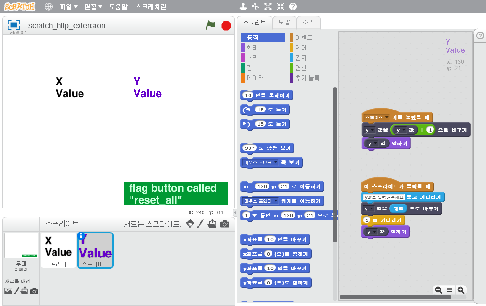

# 스크래치 2.0 HTTP Extension 만들기 

> 목적:
스크래치2.0에 확장블럭 만드는 방법을 빠르게 습득하기. 
하드웨어기반의 코딩학습툴로 스크래치를 많이사용한다. 
그 기반이 되는 확장블럭을 간단히 구현해본다. 

### 개발환경 및 참고문헌 

개발환경:
- 스크래치 2.0 offline
- python 2.7 

참고문헌:
- [스크래치 2.0 HTTP Extension](https://wiki.scratch.mit.edu/wiki/File:ExtensionsDoc.HTTP-9-11.pdf)

### 소스 및 설정파일  

- scratch_http_extension.py
~~~python

#-*- coding:utf-8 -*-
from BaseHTTPServer import BaseHTTPRequestHandler,HTTPServer
import urllib

# 작성일: 2018.02.17 
# 작성자: 박성완(adsloader99@gmail.com)
# Scratch 2.0 http extension doc 참고했음.
# https://wiki.scratch.mit.edu/wiki/File:ExtensionsDoc.HTTP-9-11.pdf

PORT_NUMBER = 50505

# DB처럼 값을 저장하기 
DB = {}
def initDB():
    global DB
    DB = { "x" : 0, "y" : 0 }

# poll처리  
def onReq_Poll(params):
    lines = []
    lines.append('value/x ' + str (DB["x"]) )
    lines.append('value/y ' + str (DB["y"]) )
    response = '\n'.join(lines)
    
    print response        
    return response    

# reset_all처리  
# !!!!!! 가끔 flag 버튼을 누르면 호출된다.!!!! 
# 결론: flag 버튼을 누르면 기능이 완료되고 reset_all이 호출된다. 
# 통신상의 문제는 전혀없다. 컨셉이다.  
def onReq_reset_all(params):
    print "reset all 처리!"   
    initDB()

# crossdomain처리  
def onReq_crossdomain(params):
    return '<cross-domain-polocy>\n' \
                   '  <allow-access-from domain="*" to-ports="{}"/>\n' \
                   '</cross-domain-polocy>\x00'.format(50505)

# myCommand 처리   
def onReq_myCommand(params):
    response = ""
    response = ADDED_COMMANDS.get(params[0], onReq_myCommand)(params)
    return response

# myCommand 처리 - setValue  
def onReq_myCommand_setValue(params):
    response = ""
    if(params[1] == "x"):
        DB["x"] =  params[2]
                
    elif(params[1] == "y"):
        DB["y"] =  params[2]

    print DB    
    return response

# Scratch 2.0 HTTP extension 커맨드 & Handler table
BASIC_COMMANDS = {
    "crossdomain.xml" : onReq_crossdomain, 
    "poll"            : onReq_Poll,
    "reset_all"       : onReq_reset_all  
}

# 추가로 구현한 커맨드 & Handler table 
ADDED_COMMANDS = {
    "setValue" : onReq_myCommand_setValue
}

# HTTP Handler
class reqHandler(BaseHTTPRequestHandler):
	
    def do_GET(self):
        params = urllib.unquote_plus(self.path.strip('/')).split('/')
        result = self.process(params)

        self.send_response(200)
        self.end_headers()
        self.wfile.write(result)

    def process(self, params):
        response = ""
        response = BASIC_COMMANDS.get(params[0], onReq_myCommand)(params)
        return response	            	    

if __name__ == "__main__":
    
    try:
        initDB()
        server = HTTPServer(('', PORT_NUMBER), reqHandler)
        print 'Started httpserver on port ' , PORT_NUMBER
    	
        server.serve_forever()

    except KeyboardInterrupt:
        print '^C received, shutting down the web server'
        server.socket.close()
	

~~~

- scratch_http_extension.s2e
~~~
{
    "extensionName": "기초예제: 확장블록",
    "extensionPort": 50505,
    "blockSpecs": [
        [" ", "%m.valueName 값을 %n 으로 바꾸기", "setValue"],
        ["r", "%m.valueName 값", "value"],
    ],
    "menus": {
        "valueName": ["x", "y"]
    },
}
~~~

- scratch_http_extension.sb2

---
### 참고사항   
- 스크래치 2.0 offline editor에서 http extension(http 확장기능) 파일(.s2e)을 읽어들이려면 shift를 누른 상태로 파일메뉴를 누른다. 
- HTTP extension이 의미하고 있지만 확장블럭은 http로 local(127.0.0.1)의 특정포트로 통신하는 방법이다.   
- 30초 단위로 polling을 한다(스크래치가 http 서버에게 값을 요청).
- 프로토콜은 [스크래치 2.0 HTTP Extension](https://wiki.scratch.mit.edu/wiki/File:ExtensionsDoc.HTTP-9-11.pdf)를 참조한다. 
- Sync를 맞추기위해 값을 서버에서 가져오거나 보낼 떄는 전달방법을 고민해야 한다. 

### 실행 
윈도우에서 스크래치 2.0 offline 에티터가 설치되어 있고, python 2.7로 서버를 실행하는 환경. 
1. scratch_http_extension.sb2를 더블클릭하여 실행 
2. python scratch_http_extension.py로 실행 

